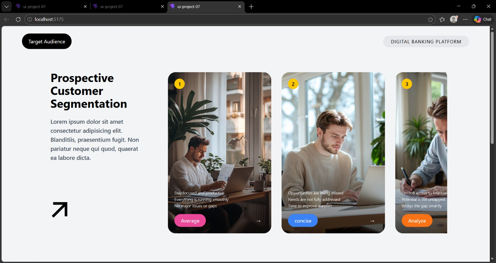

# 🚀 Customer Segmentation UI

A modern and responsive UI for customer segmentation built using React and Tailwind CSS.

## ✨ Features
- Interactive card-based UI
- Horizontal scrolling layout
- Dynamic data rendering
- Smooth hover animations
- Clean and modern design

## 🛠 Tech Stack
- React.js
- Tailwind CSS

## 📸 preview.png


## ⚡ Installation
```bash
git clone https://github.com/alokchoudhary885-coder/customer-segmentation-ui.git
cd customer-segmentation-ui
npm install
npm run dev